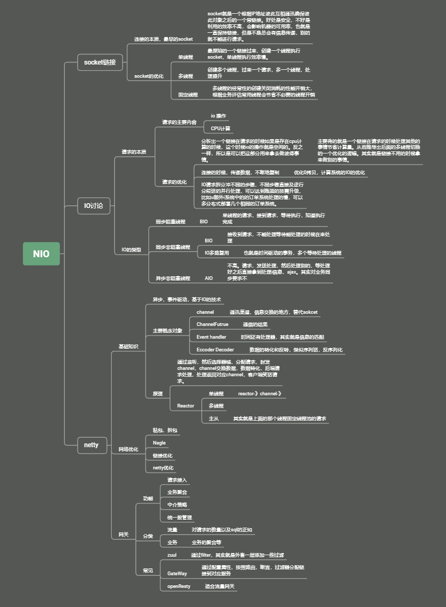

Nio的总结：

Nio就是连接的优化。

从根本上分析链接是什么，让后把链接拆分开的io和cpu两个方面进行优化。

链接实质是一个客户端的请求通过，socket的IP地址链接，然后去进行数据确认关联交互数据，客户端接受到请求之后通过三次三次握手，四次挥别握手来完成一个请求来凝结的业务处理。

整体就是搭建信息通道，然后都断监听到服务，然后在当前的进行中区执行任务，后面的任务根据数据和请求逻辑，进行cpu的计算，还有内存的数据IO的操作，比如插入或者是读取数据，然后返回给用户。

然后从连接的一个线程处理，到多个线程处理，在到固定的线程池的处理请求。这个是多系统中的线程数量维护的一个进化。主要是在提升处理速度的情况下，保证性能开销。从而达到的达到技能处理好业务请求也能把性能频繁操作优化。

其次是连接的实际操作中，CPU的计算还有io的优化，CPU的优化主要是在业务在进行io的时候计算机cpu可以拿来提供计算量，io则是减少了系统内部计算机的复制，所谓的零拷贝就是了，主要说的是计算机的不拷贝，体现在linux系统中多，内存合并使用了。

接着是io的类型分类。其实就是把请求根据处理的是否同步还有阻塞性分为了阻塞非阻塞，同步非同步的线程请求。

同步就是请求的同时处理，非同步就是不要求直接的等待他执行。

阻塞和非阻塞则主要是请求的不成功是否需要等待。

主要情调的就是BIO,NIO,AIO.从而从请求的信号方面区把线程进行优化。主要就是请求的等待和不等待，从而避免了处理的业务不必要的时间浪费。还有扩大以及提高请求的执行情况。比如NIO的，同步非阻塞。

避免了请求卡在一个地方。

接着是netty的实际使用场景举例。

netty是一个市场通用解决方案。他对请求的处理，主要也就是请求的处理请求的高并发的多请求接受，以及他的内存的零拷贝。他是行业务其他比如dubbo的理论基础。其实就是基础上面对请求的分析，包括了他的请求的业务处理的类型，根本上CPU和IO的优化处理。

记得netty就是一个线程接受到请求，然后根据请款区进行分发，他的实现还有存在很多可以研究的地方。包括他的时间监听等。

最后网络IO的根本从1.0的代理设置到2.0的服务的过滤到3.0的路由分配。启发的是一个技术或者是业务从简单到负责，在到抽象，组块话，具体话的一个认知到落地的实现过程。