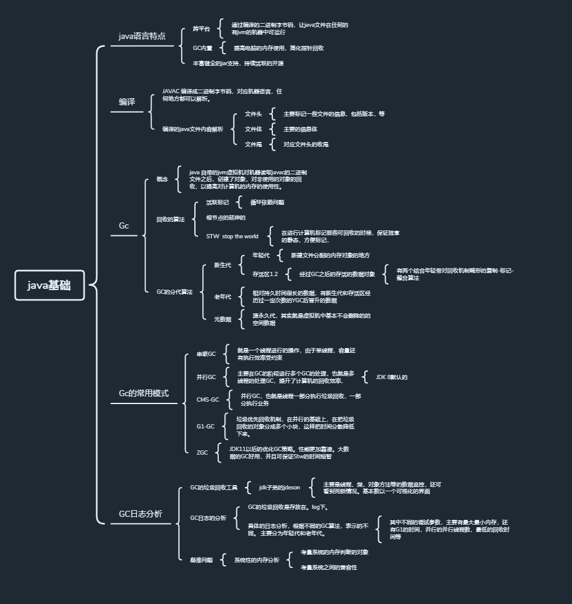

java基础是入门的第一堂课，首先介绍了java语言。从计算机语言的原理，再到计算机语言的横向对比中，体现java语言的跨平台以及他的丰富的支持性--跨平台以及内存回收机制。

主要围绕这个两个知识点进行的讲解，从原理，再到具体的操作验证，接着是代码的形式验证。在关联到具体的项目中，最后到他的实际意义，可能出现的问题，解决的情况的。

具体的来说：

java的跨平台。首先说的java的二进制字节码形式，一个java语言编译之后，在各个平台上只要有个了java的解读器就都可以识别。说白了在个中比如linux，window，或者其他的语言中优都可以用java自带的丰富的可执行jar，也就是编辑好的语言。

从根本上来说一个java语言编辑出来就利用已经有的java中的语言规范，进行数据，最后转化成二进制的字节码文件，就是计算机语言，可被计算机识别执行。

这里面主要讲解的就是利用java的内置语言，然后通过javac编辑成计算机语言，到哪里都可以被计算机认识。

后续解读了一个java文件的组成。根本就是文件头的描述，文件提的描述，还有文件为的描述。然后是一个文件占据的数据的大小。说明了 一个文件的组成，然后就是里面的在进一步的讲解，也就是一个文件是由基本类型组成，引用对象组成。

这个基础对象就是不同的bete，short，int，long.从二进制字节到基础类型的转化，表示了多少的占据的内存空间。而引用对象的创建一些基础的数据对象组成的结构数据。

这里主要的内容是关联跨平台。如何跟二进制进行转化。也就是如何用二进制编译成我们的编程语言。

在项目中实际的影响的是这个对象代表的带下，一个文件类创建出来编译之后，会占据的空间大小。

最结合开发中的就是项目中的内存不足够。这就是因为创建的文件从而编译的二进制文件大于了分配的内存空间。也就是jcm的xmx，xms等。

第二个核心的点就是内存垃圾回收机制。上面说了一个程序就是一些文件占据内存，变成二进制的文件，利用1001的表示我们要做的逻辑处理。从而需要占用内存数据。也就是运行的地方。用数据的存储说就是从最早的光刻到后来的电子处理盘，但是总会是有内存空间的限制。所以需要对数据进行整理，腾出空间持续的区操作。

这个腾出空间的操作就是java的GC算法。从开始的最基本的单个的回收，到不满足，执行太慢解决的方法提出更多同时回收。在到考量到影响业务，发展出的并行的GC，再到垃圾回收的G1回收机制，也就是把内存分开哎，价绍一次性的大回收时间太长。再到大数据的GC内存也就是ZGC。

从他实现阅历上来说一个是分代的进行处理，也即是新生代，老年代，元数据。新生代细分年轻代，还有两个存活区。其实说的就是想起启动之后基本不会删除的数据文件，一直用的就是元数据，比较常用的就是老年代，最后就是常用长删除的文件，以及常用之后一定程序作为常用数据的短暂数据的晋升。

从而把数据文件按照使用的成都对内存空间，调整。不用的就删除，用的多的就多保存。

他的判断对象的引用方式两种，1引用的标记，2根节点的衍生。从引用成都上，分为强引用，弱引用，软应用，硬引用。也就是根据对象的不用区看情况分级别回收，印象中的线程有个是守护线程就是可以被作为优先引用的。

从项目中来说就是内存的移出，解决方法就是开源和节流。也就是常说的调整jvm的内存大小，或者是G1的最小的内存块大小。从而达到的效果是系统给的内存大小足够使用。再就是加大GC的回收的速度。比如G1的垃圾优先回收。通俗的理解就是一个储水池进水流水的原理。

从java看，jvm的几个组成都会有这个内存的问题，解决方法都是开源节流。

从GC的日志分级来看，不同的GC对应不用的业务场景需求，他的GC的日志记录也不相同。主要看这个日志那个地方被卡住了。尽量的避免fullGC。因为fullGC会导致的STW也就是系统因为内存回收的整体回收。整体回收会导致系统卡顿，印象业务和性能，对尤其大数据，大业务量造成很大的阻碍。

从开发角度，分析以及实际的i项目中，是可以通过日志工具来进行系统的全量监控的，其次日志也是个参考文件。

从系统整体看的话，也会存在一个各个系统直接流的的兼容问题。也就是某个系统的内存过大，下流的程序也要能兼容这个数据量，如果数据不能达到满足，就会内存溢出。导致系统数据丢失。不断地FullGC，系统进行暂停，丢失数据，系统不可使用。

以上就是基础主要的内容，围绕的就是跨平台，以及内存的管理。从而可以让java能够在各个计算机系统中，运行，并且考量周全系统的空间问题。做到搞笑利用空间，避免系统因为内存不足。提升系统的运行和稳定性。