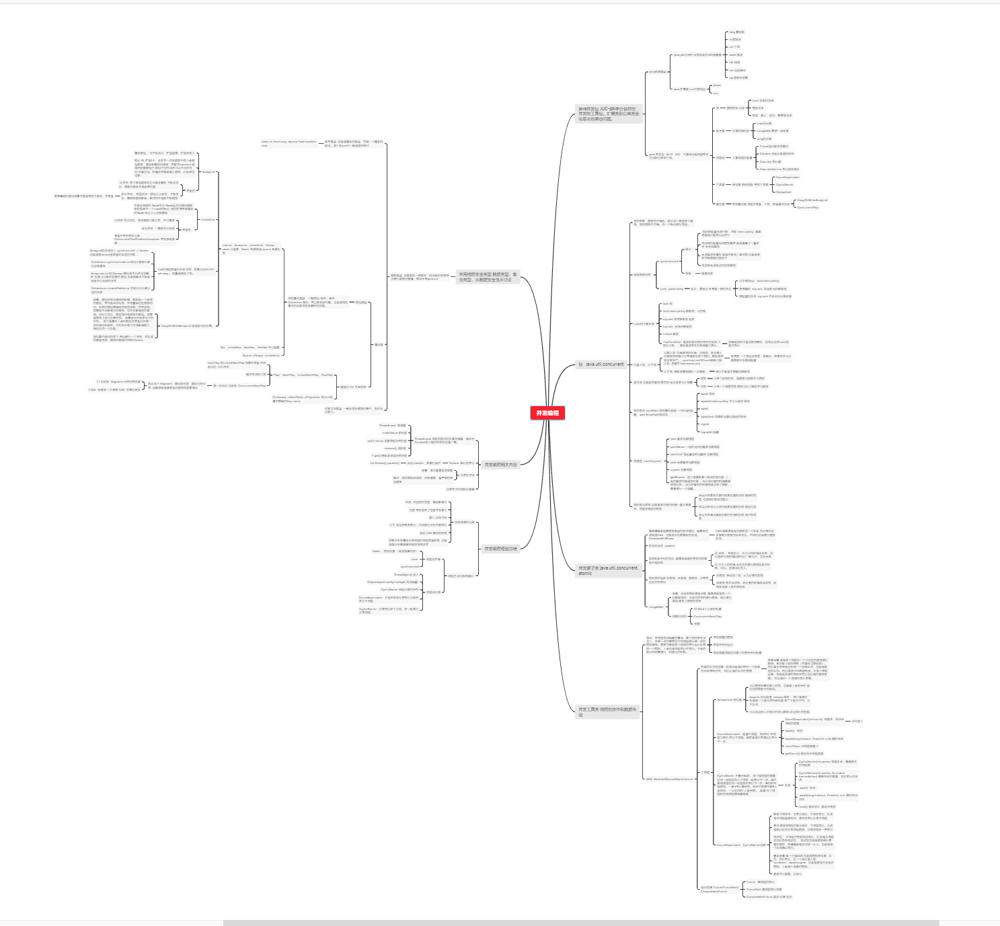

并发编程 

并发编程西先是说明了下java的基本并发编程报的Util包。介绍了里卖弄对于所得主要构成：锁，源自类，线程池，工具类，集合类。接着是个的对每个组成进行详细的讲解。

锁，降级的锁的由来，保证数据互相不影响。两种所得方式synchronized和Lock，对比优缺点，一个是方便，一个是灵活可配置。然后说明了锁的类型，可重入锁，公平锁，以及他的读写锁。表示针对不同的业务场景解决的不同的数据问题。

接着就锁的状态进行了分析，表示所得不同阶段，以及所得操作。其实就是数据的一个控制。

最后是所得一个优化，尽量的缩小范围减少影响，可能的话降低所得力度。

接着是并发原子类，并发原子类就是数据的基本类型，主要是把锁的对象拆分到最基本的原子类型。通过对比的方式减少锁的开销。介绍了无锁的乐观锁和悲观锁。

接着是线程的协作和数据传输，说的是线程互相直接关系，包括了几种互相协作的锁的工作机制，还有数据的传输，一个是公用的一个复制参数的。其中在写作中介绍了数据之间彼此的等待等操作。

接着是已经封装的数据的线程类型。介绍了他们的主要特点还有内部如何实现，。

最后说明了并发编程的本地线程，单行并行，伪并发等问题。并发线程中的考量因素，包括了现成的加锁力度还有他的性能开销等。